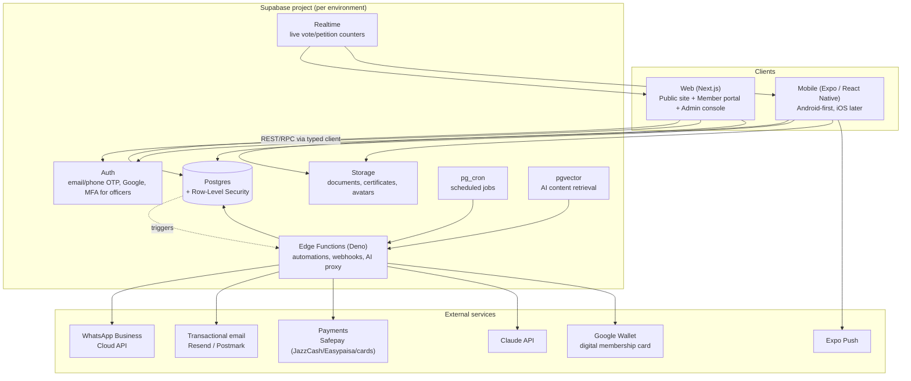

# 01 — Architecture

Design-package document. No application code is included in this pass — this
describes the target architecture for Phases 1–4 (the member portal, mobile
app, governance automation and admin console). Phase 0, the public website,
is already built and live in this repo at `website/` (Next.js, static
export) — see [08-roadmap.md](./08-roadmap.md).

## 1. System diagram

## 2. Stack choices

| Layer | Choice | Why |
|---|---|---|
| Monorepo | **Turborepo** (npm workspaces) | Shared `packages/types`, `packages/ui`, `packages/api-client` between web, mobile and admin; single source of truth for the data model and RBAC constants used to enforce the Rules client-side (in addition to server-side RLS). |
| Web | **Next.js (App Router)** | Already the stack for the public site (`website/`). SSR/ISR for SEO on public pages; the member portal and admin console become authenticated route groups in the same app or a sibling `apps/web-portal` — see open question in [09](./09-open-questions.md). |
| Mobile | **Expo / React Native**, Android-first | Matches the existing `Bytebuz-marketing-engine` app already in this repo (same stack, so the team's existing Expo/EAS knowledge carries over). Offline caching (courses, membership card) via Expo SQLite/AsyncStorage. |
| Backend | **Supabase** (Postgres, Auth, Storage, RLS, Edge Functions, pg_cron, Realtime, pgvector) | Chosen over a hand-rolled Azure stack because RHEAP runs with almost no staff (brief §2.2): Supabase collapses auth, database, file storage, scheduled jobs and serverless functions into one managed service with a generous free/low tier, so there is no infrastructure team required. **Row-Level Security maps directly onto governance rules** — e.g. "only EC officers can approve applications" or "a member in arrears cannot vote" become Postgres policies enforced at the database layer, not just in application code, which matters for an association whose credibility depends on auditable, tamper-resistant governance. `pg_cron` + Edge Functions handle every automation in [05-automations.md](./05-automations.md) (renewal reminders, meeting-notice enforcement, vote auto-close) without a separate job-queue service. Realtime gives live EGM-petition and vote counters for free. |
| Backend alternative (challenged) | Azure (App Service + Azure SQL + Functions + Entra ID) | More common in enterprise/government contexts and could matter if a future government-cooperation agreement requires Pakistani data residency or a specific certification — Supabase's nearest regions are Singapore/Mumbai, not Pakistan. Not recommended for now: materially higher operational overhead for a zero-staff non-profit, and RLS-as-governance-enforcement is harder to replicate cleanly in Azure SQL. Flagged as an open question in [09](./09-open-questions.md) in case data residency is a hard requirement. |
| Messaging | WhatsApp Business Cloud API (via a Pakistan-capable BSP), Resend/Postmark for email, Expo Push | WhatsApp is the primary channel per brief §2.4; a Business Solution Provider is needed for number provisioning and template approval in Pakistan (not just the raw Meta API). |
| Payments | **Safepay** as primary aggregator (covers JazzCash, Easypaisa, cards) + manual bank-transfer reconciliation | Single integration covering the main local payment methods; toggled off entirely at launch since fees are undetermined (Rules §11) — see [09](./09-open-questions.md). |
| AI | Claude API called from an Edge Function, never directly from the client | Keeps the API key server-side, lets every prompt/response be logged (brief §8, "AI" and §5.9 "cites its sources"), and lets retrieval run against `pgvector` over an **approved-content-only** table, not the open Rules text or unvetted material. |
| Hosting | Vercel (web), Supabase (backend), EAS Build/Update (mobile) | Vercel + Supabase is the standard, well-documented pairing for this stack, minimizing DevOps surface for a small founding team. |
| Auth | Supabase Auth — phone/email OTP, optional Google, **mandatory MFA for EC Officer role** | OTP fits a WhatsApp-first, low-bandwidth membership base better than password auth; MFA is restricted to officers because they can approve members, open votes and authorize significant payments (Rules §26). |

## 3. Environments

| Environment | Supabase project | Web | Mobile | Purpose |
|---|---|---|---|---|
| Local | Supabase CLI (local Postgres via Docker) | `next dev` | Expo dev client | Development, seeded with fixture data (fake members, a mock General Meeting). |
| Staging | Separate Supabase project | Vercel preview deployments | Expo internal distribution | EC/officer review before anything goes live — e.g. testing a real vote flow without it counting. |
| Production | Production Supabase project, daily backups, point-in-time recovery enabled | Vercel production (rheap.org) | Google Play (Android first), TestFlight later | Live membership, meetings, votes, payments. |

Secrets (Claude API key, WhatsApp BSP token, Safepay keys) live in Supabase
Edge Function secrets and Vercel environment variables — never in client
bundles, matching the brief's "no patient health data, minimal personal
data" security posture extended to credentials generally.

## 4. Cost estimate

See [09-open-questions.md](./09-open-questions.md) for the requested cost
breakdown at 500 / 5,000 / 50,000 members — it depends on which Supabase and
Vercel tiers are chosen, which is itself downstream of the backend decision
above, so it's tracked as an open question rather than guessed here.
