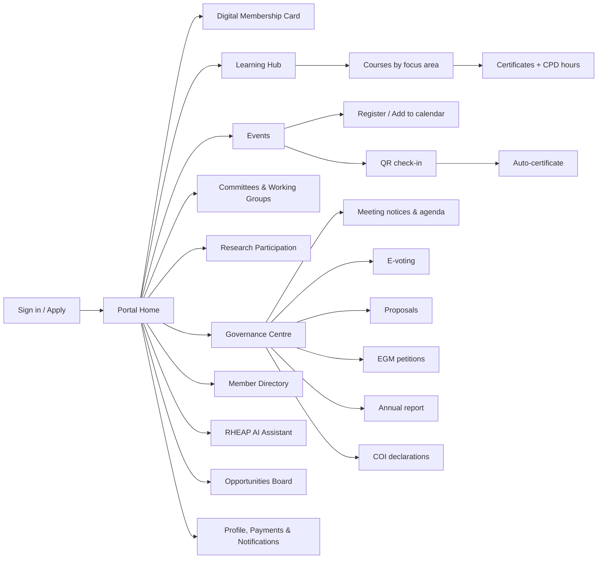

# 02 — Sitemap & Information Architecture

## 1. Public website (built — `website/`, Phase 0)

Already live in this repo. Reproduced here for completeness of the design
package:

```
/                    Home — mission, what RHE is, focus areas preview, join CTA
/what-is-rhe         RHE definition (Rules §5), RHE vs. telemedicine
/focus-areas         Women's Health, Hypertension, Diabetes, TB & Respiratory Health
/about               Nature/purpose, governance, committees, founding status
/rules               Full Rules & Regulations (web + downloadable PDF)
/research            Research & evidence intent (founding-phase placeholder)
/join                Membership eligibility + interest form
/contact             Contact details
```

Not yet built, deferred to later phases per the brief's own sitemap (§4):

- `/events` — conferences, workshops, webinars, with registration (Phase 2)
- `/news` — blog/newsroom (Phase 2, content CMS)
- `/supporters` — partners/sponsors with transparent disclosure (Rules §25) — populate once RHEAP has any (currently none, still founding)
- Language toggle EN/UR — deferred; see [09-open-questions.md](./09-open-questions.md)

## 2. Member portal (web) + mobile app navigation

Both surfaces share the same backend and information architecture; the
portal is the desktop-oriented "everything" surface, the app is the
mobile-first, offline-friendly subset.



### Portal/app sections

| Section | Web portal | Mobile app | Notes |
|---|---|---|---|
| Digital membership card | ✓ (view/download) | ✓ (primary use case — shown at events) | QR + Google Wallet pass |
| Learning hub | ✓ | ✓ (offline video/course caching) | |
| Events | ✓ | ✓ (QR check-in via camera) | |
| Committees & working groups | ✓ (full: docs, threads, scheduling) | ✓ (read + participate, lighter doc editing) | |
| Research participation | ✓ | ✓ (view/join; case-report submission best on web for longer forms) | |
| Governance centre | ✓ (primary surface for reading papers) | ✓ (voting works on mobile; document-heavy agenda review better on web) | |
| Member directory | ✓ | ✓ | Opt-in only |
| RHEAP AI Assistant | ✓ | ✓ | Same backend endpoint |
| Opportunities board | ✓ | ✓ | |
| Profile & payments | ✓ | ✓ | |

## 3. Admin / EC console (web only)

A role-gated section of the web app (or a separate `apps/admin` — see
[09-open-questions.md](./09-open-questions.md)):

```
/admin
├── applications        Queue, approve/reject (Rules §8 grounds picklist)
├── members              Register, export, audit trail, status history
├── finance
│   ├── fees-payments    Dashboard
│   └── ledger           Dual-approval ledger (Rules §26)
├── meetings              Create/manage General Meetings, notice enforcement
├── voting                 Open/close votes, results, audit log
├── committees             Manage committees & membership
├── content (CMS)          Pages, news, courses, events — EN/UR
├── sponsors                Register + disclosure flags (Rules §25)
├── analytics                Growth, engagement, geography, focus-area interest
└── audit-log                 Every governance action, immutable
```
