# 03 — Data Model

Entity-relationship design for the Supabase/Postgres schema. Table and
column names are illustrative (snake_case, matching Postgres convention) —
exact types/constraints get finalized when implementation starts.

```mermaid
erDiagram
    MEMBERSHIP_CATEGORIES ||--o{ MEMBERS : "assigned to"
    APPLICATIONS ||--o| MEMBERS : "approved into"
    MEMBERS ||--o{ PAYMENTS : makes
    MEMBERS ||--o{ COI_DECLARATIONS : declares
    MEMBERS ||--o{ COMMITTEE_MEMBERSHIPS : joins
    COMMITTEES ||--o{ COMMITTEE_MEMBERSHIPS : has
    MEMBERS ||--o{ COURSE_ENROLLMENTS : enrolls
    COURSES ||--o{ COURSE_ENROLLMENTS : has
    COURSE_ENROLLMENTS ||--o| CERTIFICATES : issues
    MEMBERS ||--o{ EVENT_REGISTRATIONS : registers
    EVENTS ||--o{ EVENT_REGISTRATIONS : has
    EVENT_REGISTRATIONS ||--o| EVENT_ATTENDANCE : "checks in as"
    EVENT_ATTENDANCE ||--o| CERTIFICATES : issues
    MEETINGS ||--o{ VOTES : contains
    VOTES ||--o{ BALLOTS : receives
    MEMBERS ||--o{ BALLOTS : casts
    MEETINGS ||--o{ EGM_PETITION_SIGNATURES : "petitioned via"
    MEMBERS ||--o{ EGM_PETITION_SIGNATURES : signs
    SPONSORS ||--o{ SPONSORSHIPS : gives
    SPONSORSHIPS ||--o| LEDGER_ENTRIES : records
    MEMBERS ||--o{ AUDIT_LOG : "acts (actor_id)"

    MEMBERSHIP_CATEGORIES {
        uuid id PK
        text name "Full, Student, ..."
        numeric annual_fee "nullable = free"
        boolean voting_rights "true per Rules §9 — categories don't restrict this"
    }

    APPLICATIONS {
        uuid id PK
        text full_name
        text email
        text phone
        text profession_role
        text pmdc_pnmc_number "nullable"
        text pmdc_pnmc_verification_status "unverified|pending|verified|not_applicable"
        uuid coi_declaration_id FK
        text status "submitted|in_review|approved|rejected"
        text rejection_ground "Rules §8 picklist, nullable"
        uuid reviewed_by FK "EC officer, nullable"
        timestamptz submitted_at
        timestamptz decided_at
    }

    MEMBERS {
        uuid id PK
        uuid auth_user_id FK "Supabase auth.users"
        uuid application_id FK
        uuid membership_category_id FK
        text membership_number UK
        text full_name
        text email
        text phone
        text city
        text specialty
        boolean directory_opt_in
        text status "good_standing|not_in_good_standing|expelled|resigned"
        date joined_at
        date renewal_due_at
    }

    PAYMENTS {
        uuid id PK
        uuid member_id FK
        text purpose "membership_fee|event|donation"
        numeric amount
        text currency "PKR"
        text method "safepay|bank_transfer|manual"
        text status "pending|paid|failed|reconciled"
        timestamptz created_at
    }

    COI_DECLARATIONS {
        uuid id PK
        uuid member_id FK
        text declaration_type "annual|ad_hoc_vote|ec_officer"
        text details
        uuid related_vote_id FK "nullable, for ad-hoc pre-vote declarations"
        timestamptz declared_at
    }

    COMMITTEES {
        uuid id PK
        text name
        text focus_area "nullable — links to the 4 initial areas or null for cross-cutting"
        boolean is_active
    }

    COMMITTEE_MEMBERSHIPS {
        uuid id PK
        uuid committee_id FK
        uuid member_id FK
        text role "chair|member|external_expert"
        date joined_at
    }

    COURSES {
        uuid id PK
        text title
        text focus_area
        text language "en|ur"
        boolean requires_quiz
        numeric cpd_hours
    }

    COURSE_ENROLLMENTS {
        uuid id PK
        uuid course_id FK
        uuid member_id FK
        text status "in_progress|completed"
        numeric quiz_score "nullable"
        timestamptz completed_at
    }

    CERTIFICATES {
        uuid id PK
        uuid member_id FK
        text source_type "course|event"
        uuid source_id "course_enrollments.id or event_attendance.id"
        text wording "participation/completion only — never 'licence'"
        numeric cpd_hours
        text pdf_url
        timestamptz issued_at
    }

    EVENTS {
        uuid id PK
        text title
        text type "conference|workshop|webinar"
        timestamptz starts_at
        timestamptz ends_at
        text location "nullable for virtual"
        text recording_url "nullable"
    }

    EVENT_REGISTRATIONS {
        uuid id PK
        uuid event_id FK
        uuid member_id FK
        timestamptz registered_at
    }

    EVENT_ATTENDANCE {
        uuid id PK
        uuid event_registration_id FK
        timestamptz checked_in_at
        text checkin_method "qr"
    }

    MEETINGS {
        uuid id PK
        text type "agm|egm"
        timestamptz scheduled_at
        timestamptz notice_sent_at
        text agenda_url
        text format "physical|virtual|hybrid"
        text status "scheduled|held|cancelled"
    }

    VOTES {
        uuid id PK
        uuid meeting_id FK
        text question
        text vote_type "standard|rules_amendment"
        text majority_required "simple|two_thirds"
        boolean secret_ballot
        timestamptz opens_at
        timestamptz closes_at
        text status "open|closed|tallied"
        text result "nullable until tallied"
    }

    BALLOTS {
        uuid id PK
        uuid vote_id FK
        uuid member_id FK
        text choice "yes|no|abstain"
        timestamptz cast_at
    }

    EGM_PETITION_SIGNATURES {
        uuid id PK
        uuid meeting_id FK "nullable until an EGM is formally called"
        uuid member_id FK
        text matter_requested
        timestamptz signed_at
    }

    SPONSORS {
        uuid id PK
        text organisation_name
        text status "supporting_organisation|partner|sponsor"
        text disclosure_summary "public"
        boolean is_public
    }

    SPONSORSHIPS {
        uuid id PK
        uuid sponsor_id FK
        text type "financial|in_kind"
        numeric amount "nullable for in-kind"
        text description
        timestamptz received_at
    }

    LEDGER_ENTRIES {
        uuid id PK
        text type "income|expense"
        numeric amount
        text category
        uuid approved_by_1 FK "officer, nullable until approved"
        uuid approved_by_2 FK "officer, required above threshold — Rules §26"
        text status "pending|approved|rejected"
        timestamptz created_at
    }

    AUDIT_LOG {
        uuid id PK
        uuid actor_id FK "members.id, nullable for system actions"
        text action "e.g. application.approved, vote.opened, ledger.approved"
        text entity_type
        uuid entity_id
        jsonb before
        jsonb after
        timestamptz created_at
    }
```

## Notes

- **`membership_categories.voting_rights` defaults to `true` for every
  category**, including Student — the actual Rules text (§9) ties voting to
  being "a member in good standing," not to fee category. Student-category
  members are full voting members unless a future Rules amendment says
  otherwise. See [07-rules-compliance-map.md](./07-rules-compliance-map.md).
- **`AUDIT_LOG` is append-only** (no update/delete grants, even for Super
  Admin) — this is what makes "full audit log of every governance action"
  (brief §7) meaningful rather than just a UI feature.
- **`COI_DECLARATIONS.related_vote_id`** implements "an ad-hoc declaration
  before any vote they participate in" (brief §5.7) as a first-class,
  queryable link rather than free text.
- Row-Level Security policies (not shown here) enforce, e.g.: a `BALLOTS`
  row can only be inserted by the ballot's own `member_id` while
  `status = good_standing` and the parent `VOTES.status = open`; `LEDGER_ENTRIES`
  requires two distinct `approved_by` officers before `status` can become
  `approved`.
