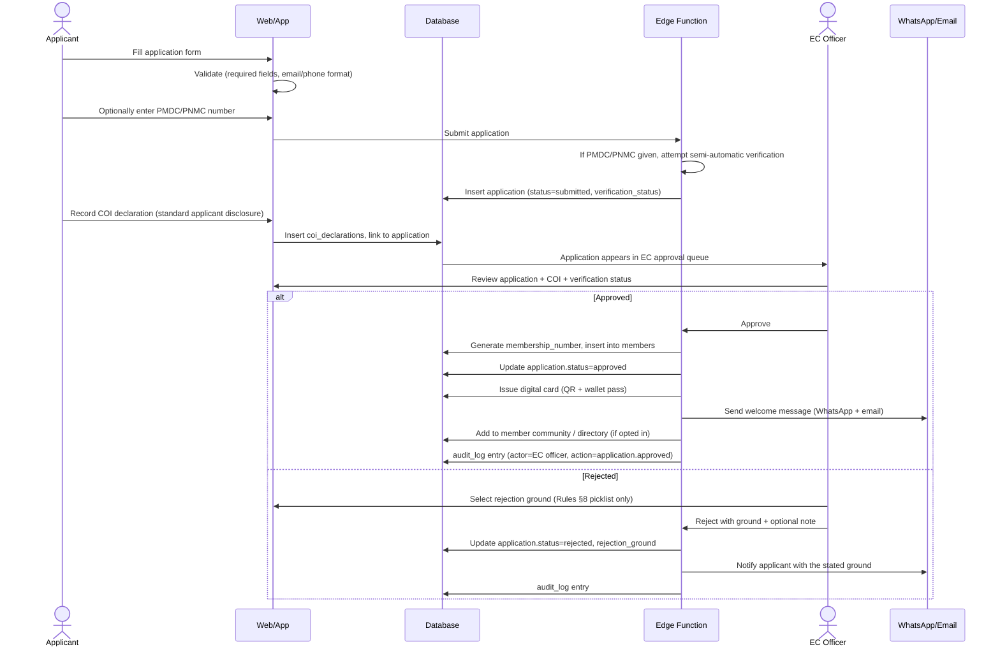
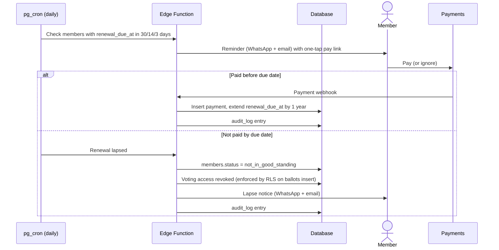
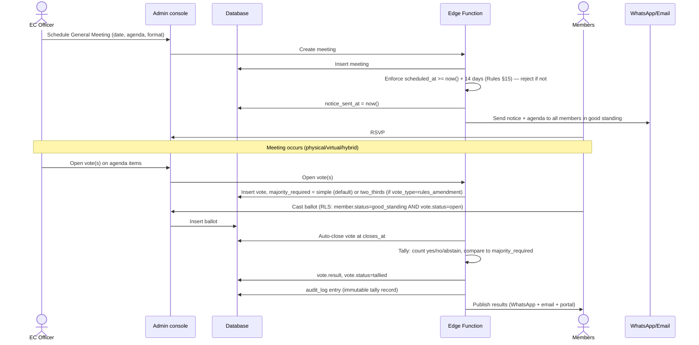
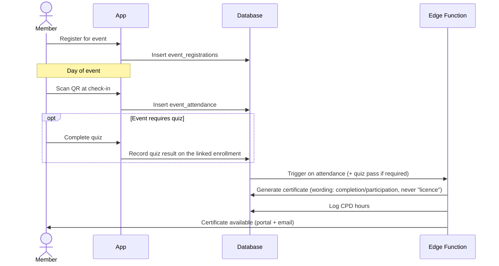
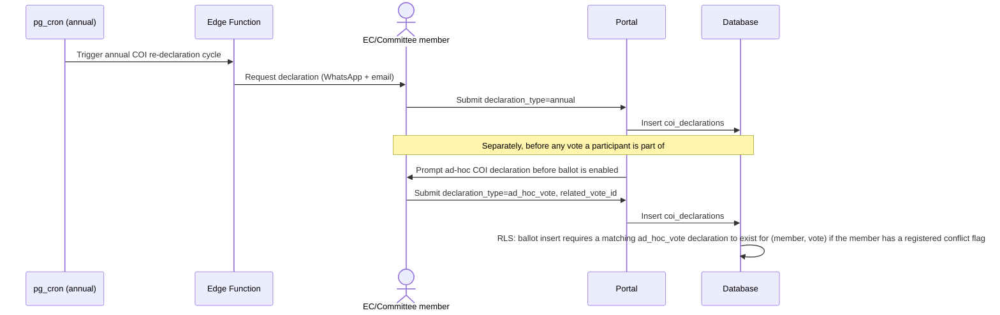

# 04 — User Flows

## 1. Application → Approval

Per the brief's detailed application flow (§6) and Rules §8.



## 2. Renewal



## 3. AGM: Notice → Vote → Result

Encodes Rules §13 (AGM), §15 (≥14 days' notice), §16 (voting), §31 (⅔ for
amendments).



## 4. EGM Petition

Encodes Rules §14 (20% threshold).

```mermaid
sequenceDiagram
    actor M as Member
    participant W as Portal
    participant DB as Database
    participant Edge as Edge Function
    actor EC as Executive Committee

    M->>W: Sign EGM petition, state matter to be considered
    W->>DB: Insert egm_petition_signatures
    DB->>Edge: Trigger recount
    Edge->>Edge: signatures / total_voting_members_in_good_standing >= 20%?
    Edge->>W: Live counter updates (Realtime) — visible to signers
    alt Threshold reached
        Edge->>EC: Notify EC automatically (Rules §14 — EGM must be called)
        Edge->>DB: audit_log entry
        EC->>W: Schedule EGM (re-enters the AGM/EGM notice→vote flow above)
    else Threshold not reached
        Note over Edge: Counter keeps accumulating; no action until it is
    end
```

## 5. Event Attendance → Certificate



## 6. Conflict-of-Interest Declaration

Encodes Rules §22 and brief §5.7 (annual + ad-hoc before any vote).


